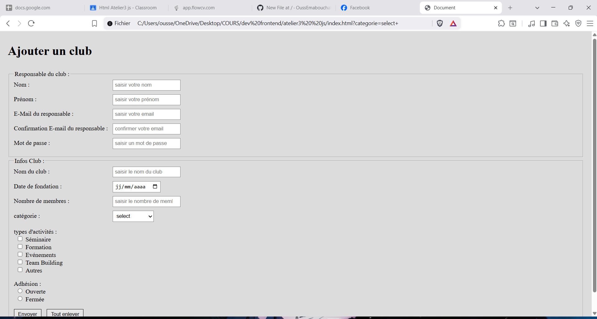

# 📝 Projet : Formulaire d'Ajout de Club (IPSAS)

<p align="center">
  
</p>

## 📖 Description
Ce projet est une interface web front-end permettant l'inscription et la création d'un club universitaire pour l'IPSAS. Il intègre un système complet de **validation de formulaire côté client** en utilisant **JavaScript natif (Vanilla JS)**. 

L'objectif principal est de s'assurer que toutes les données saisies par l'utilisateur (responsable du club) respectent des critères stricts avant d'autoriser l'envoi du formulaire, offrant ainsi une meilleure expérience utilisateur grâce à l'affichage d'erreurs en temps réel.

## ✨ Fonctionnalités

Le formulaire vérifie automatiquement les points suivants :
- **Validation du Nom / Prénom :** Doit obligatoirement commencer par une lettre majuscule (vérification par Regex).
- **Validation de l'E-mail :** Réservé aux étudiants/membres de l'établissement (doit se terminer par `@ipsas.tn`).
- **Confirmation d'E-mail en temps réel :** Affiche un message instantané si les deux e-mails ne correspondent pas.
- **Sécurité du mot de passe :** Doit contenir au moins 8 caractères, dont une majuscule, une minuscule et un chiffre (Regex).
- **Validation des dates :** La date de fondation du club ne peut pas être une date future ou rester vide.
- **Contrôle numérique :** Le nombre de membres doit être compris entre 10 et 100.
- **Éléments dynamiques du DOM :** Si l'utilisateur coche l'activité "Autres", un nouveau champ de texte apparaît dynamiquement pour lui permettre de préciser son choix.
- **Gestion des erreurs personnalisée :** Les messages d'erreur s'affichent dynamiquement en rouge directement sous le champ erroné, sans bloquer l'écran avec des alertes intempestives.

## 🛠️ Technologies Utilisées

- **HTML:** Structure sémantique du formulaire.
- **CSS :** Mise en page claire et ergonomique.
- **JavaScript :** Manipulation du DOM, expressions régulières (Regex), et écouteurs d'événements (`submit`, `input`, `change`).

## 📂 Structure des fichiers

```text
📁 Formulaire-d-Ajout-de-Club-IPSAS-/
├── 📁 assets/
│   └── 🖼️ scrine.png      # Capture d'écran du projet
├── 📄 index.html          # Structure principale du formulaire
├── 📄 style.css           # Fichier de styles (mise en page)
├── 📄 index.js            # Logique de validation JavaScript
└── 📄 README.md           # Documentation du projet
